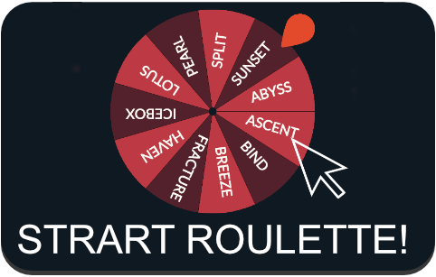
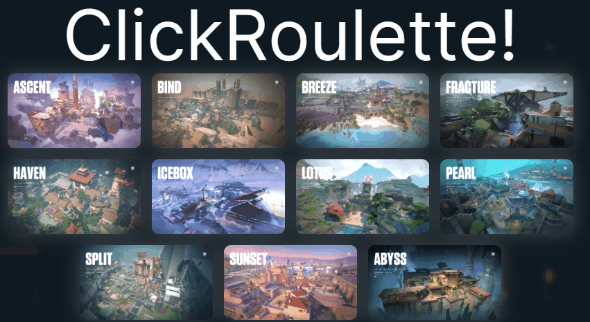

# VALORANT ROULETTE OULINE ver.2

<table><tr>


</tr></table>


[<div align="center" > </div>](https://valoapp.vercel.app/)


<p align="center">
    
</p>


> [!NOTE]
> もしなにも表示されない場合は``` F5 ``` キーを押してページをリロードしてください

> [!NOTE]
> バグがありましたらご連絡ください

## What is that

昔に作成したVALORANT ROULETTEをNEXT.jsでリメイクしました

## HOW TO USE

1. マップを選択



2. ルーレットをクリック！


## Features

- NEXT.js
- typescript
- node.js-ver.20
- tialwindCSS
- MUI
- React-custom-rulette
- React-typing


## Test on local

1. リポジトリをクローン

```bash
git clone https://github.com/2k2e2n/valoapp.git
```

2. 実行

```bash
yarn run dev
```

## Author


## License

[MIT Lisence](https://github.com/2k2e2n/valoapp/blob/master/LICENSE)</blockquote>